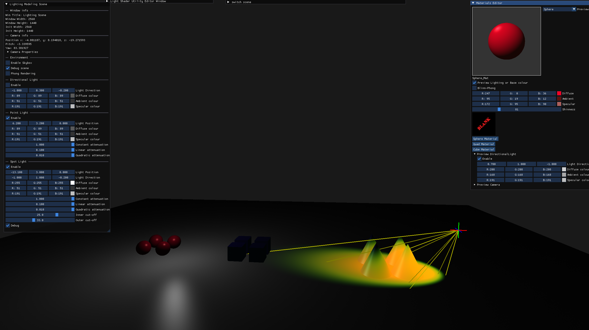

# PreglRenderer
A minimal personal OpenGL wrapper for exploring modern rendering techniques.


## Features:
- Prelinked with GLEW, GLFW, ASSIMP, GLM, and ImGui.
- Lightweight OpenGL abstraction for rapid prototyping.
- Ideal for experimenting with shaders, lighting, and real-time rendering.

## Getting Started: 

### **Requirements**
- Visual Studio community 2022
- CMake 3.15 or later.

### Retrive Project
```
git clone https://github.com/Conqster/PreglRenderer.git
```

### Generate VS Solution
```
cd PreglRenderer
cmake -G "Visual Studio 17 2022" . 
```


## Sample

||
|:-|
||